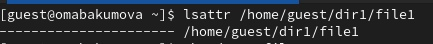
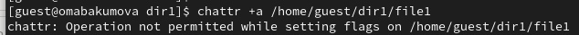
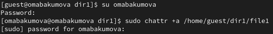
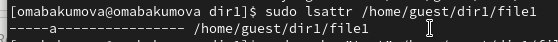
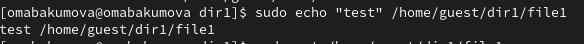
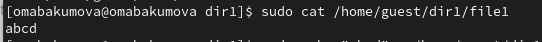
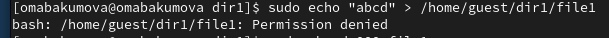
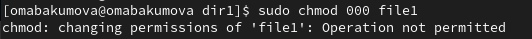
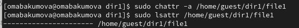
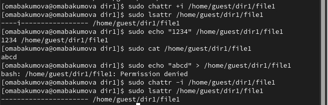

# Лабораторная работа №4.
##  Дискреционное разграничение прав в Linux. Расширенные атрибуты
### Абакумова О.М., НКАбд-01-22

---

# Цель работы
## Получить практические навыки работы в консоли с расширенными атрибутами файлов

---

# Задание
## Поэтапно выполнить все пункты лабораторной работы

---

# Теоретическое введение
## **Права доступа** определяют, какие действия конкретный пользователь может или не может совершать с определенным файлами и каталогами. С помощью разрешений можно создать надежную среду — такую, в которой никто не может поменять содержимое ваших документов или повредить системные файлы. [1]

## **Расширенные атрибуты файлов Linux** — это поддерживаемая некоторыми файловыми системами возможность ассоциировать с файловыми объектами произвольные метаданные.

---

# Выполнение лабораторной работы
 ## 1. От имени пользователя guest определите расширенные атрибуты файла **/home/guest/dir1/file1** командой **lsattr /home/guest/dir1/file1**

---

# 2. Установите командой **chmod 600 file1** на файл **file1** права, разрешающие чтение и запись для владельца файла.

---

# 3. Попробуйте установить на файл **/home/guest/dir1/file1** расширенный атрибут a от имени пользователя guest: **chattr +a /home/guest/dir1/file1**.В ответ вы должны получить отказ от выполнения операции.

---

# 4. Зайдите на третью консоль с правами администратора либо повысьте свои права с помощью команды **su**. Попробуйте установить расширенный атрибут a на файл **/home/guest/dir1/file1** от имени суперпользователя: **chattr +a /home/guest/dir1/file1**

---

# 5. От пользователя **guest** проверьте правильность установления атрибута: **lsattr /home/guest/dir1/file1**

---

# 6. Выполните дозапись в файл **file1** слова «test» командой echo "test" **/home/guest/dir1/file1**.После этого выполните чтение файла file1 командой cat **/home/guest/dir1/file1**.Убедитесь, что слово test было успешно записано в **file1**.

---

# 7. Попробуйте удалить файл **file1** либо стереть имеющуюся в нём информацию командой **echo "abcd" > /home/guest/dirl/file1**.Попробуйте переименовать файл.

Не удалось

---

# 8. Попробуйте с помощью команды **chmod 000 file1**** установить на файл **file1** права, например, запрещающие чтение и запись для владельца файла. Удалось ли вам успешно выполнить указанные команды?

Не удалось

---

# 9. Снимите расширенный атрибут **a** с файла **/home/guest/dirl/file1** от имени суперпользователя командой **chattr -a /home/guest/dir1/file1**.Повторите операции, которые вам ранее не удавалось выполнить. 

---

# 10. Повторите ваши действия по шагам, заменив атрибут «a» атрибутом «i».Удалось ли вам дозаписать информацию в файл? 

Не удалось

---

# Выводы
## Были получены практические навыки работы в консоли с расширенными атрибутами файлов

---

# Список литературы

[0] Методические материалы курса

[1] Права доступа: https://codechick.io/tutorials/unix-linux/unix-linux-permissions

[2] Расширенные атрибуты: https://ru.manpages.org/xattr/7

[3] Операции с расширенными атрибутами: https://p-n-z-8-8.livejournal.com/64493.html

---

<!-- _backgroundColor: lightblue -->

# Спасибо за внимание!